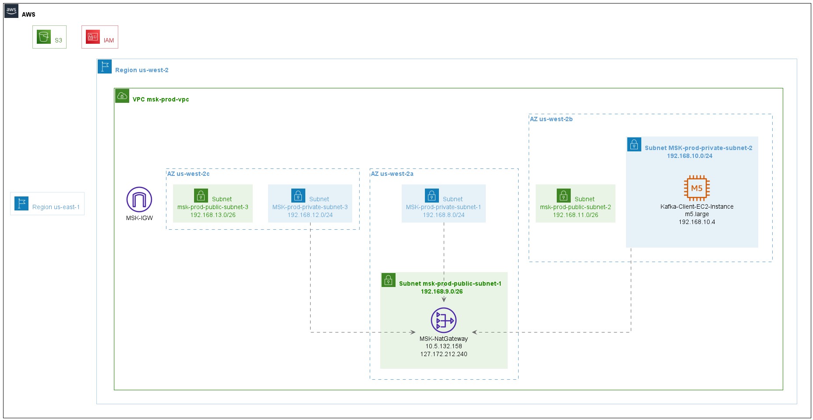

# terraform-plantuml

Generate PlantUML Images from a Terraform State file.

See [Examples](/examples) for Terraform samples and their image outputs.

# Considerations:

Take precautions when using State files (as they are open JSON files, most likely with secrets).

This package does **NOT** require Internet connection to run, nor it stores any parsed info anywhere. Its only effect is to generate two output files: .puml and optionally .png files. Any possible sensitive value is ignored, it can even be redacted beforehand if Security procedures demand so.

Safest way to generate a valid TF State file is to run `terraform init, plan & apply` locally, not logged to any real service, using a tool like LocalStack.

# Steps

*   Install `npm i -g tfpuml`
*   Download a **PlantUML JAR** from official sources ([Releases](https://github.com/plantuml/plantuml/releases))
    *   This packages comes with a script `tfpuml-download-plantuml`, run it to download a copy into this package folder
    *   Some IDEs are able to visualize PlantUML `.puml` files using plugins
*   Copy your TF state file, it is usually named `terraform.tfstate`
*   Run `tfpuml` where your TF state file resides
    *   Output: `output.puml`
*   Run `tfpuml --image` to run and export a PNG diagram
    *   Or, run `java -jar plantuml.jar output.puml` using the PUML file from previous step
    *   Output: `output.png`

## Options

*   `tfpuml <input TF state file> <output .puml file>`
    *   Defaults are `terraform.tfstate` and `output.puml`
*   `tfpuml --image` runs the PlantUML visualization graphic lib at the end and outputs an `output.png` image file
*   `tfpuml --no-check` ignores checking for Terraform Version, use it for state files versions < 1.30 (might run into issues)

See `tfpuml --help` for further options

# Support

*   AWS
    *   Buckets
    *   IAM Users
    *   Regions
        *   VPCs
            *   AZs
            *   Subnets
            *   Gateways like IGWs, NATs, and others
    *   EC2
        *   On Demand, Spot
    *   Lambdas
    *   RDS
    *   ECS (partial)
        *   Cluster

# Limitations

Since we're using PlantUML as both input and visualization, it doesn't support intersecting groups - it is a limitation of [GraphViz](https://stackoverflow.com/questions/49241869/graphviz-intersecting-but-non-recursive-clusters/62467700) and not really incentivized by PlantUML (or C4 Model) design. For this project it means groups that usually intersect with AZs like Security Groups, Beanstalk or Clusters have to rely on some group repetition.

To avoid cluttering the diagram, some AWS resources are intentionally left out, like Security Groups, IAM policies/roles and CloudWatch Logs.

# Roadmap

*   ECS Services & Tasks positioned at their subnets
*   More examples from `terraform-aws-modules`

# Acknowledgements

*   [AWS Icons for PlantUML](https://github.com/awslabs/aws-icons-for-plantuml) - This project is really a tool built on top of it - only possible because of their amazing job.
