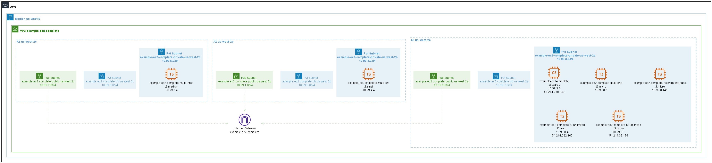

# EC2 Instances

Example from https://github.com/terraform-aws-modules/terraform-aws-ec2-instance/tree/v4.5.0/examples/complete

## Issues

*   References to KMS keys and encrypted volumes have been disabled for this example.
*   EC2 capacity reservation have been removed from the example due to LocalStack Pro lack of support.
*   Localstack needs the AMI to be owned by "137112412989", see this [list of compatible AMIs](https://github.com/localstack/moto/blob/9bfd95476b6ff55a510ea8b0ba77f98598bbf4b5/moto/ec2/resources/amis.json)
