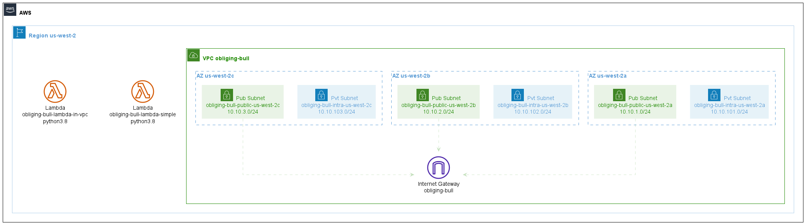

# Lambdas

Example from https://github.com/terraform-aws-modules/terraform-aws-lambda/tree/v4.16.0/examples

Mixed "simple" and "with-vpc" examples, using a provided Python "hello world" code.

## Issues

The provided example doesn't seem to create the VPC Lambda inside the VPC, actually. Localstack creates no internal `vpc_config[]` with the lambda resource.
