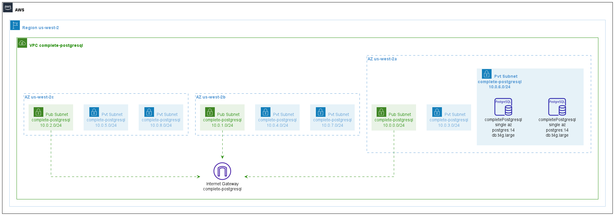

# Master and Replica RDS example for PostgreSQL

Example from https://github.com/terraform-aws-modules/terraform-aws-rds/tree/v5.6.0/examples/cross-region-replica-postgres

## Issues

As of v5.6.0 of the example, KMS keys are not working well with LocalStack Pro. It has been removed from the `main.tf` file without prejudice for the diagram.
