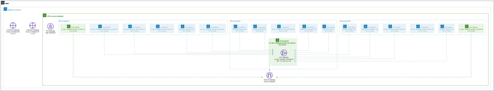

# Complete VPC

Example from https://github.com/terraform-aws-modules/terraform-aws-vpc/tree/v4.0.1/examples/complete

## Issues

As of v4.0.1 of the example, LocalStack has this known issue: https://github.com/terraform-aws-modules/terraform-aws-vpc/issues/582

Since it is marked as resolved, VPC Endpoints are just removed from the example.
